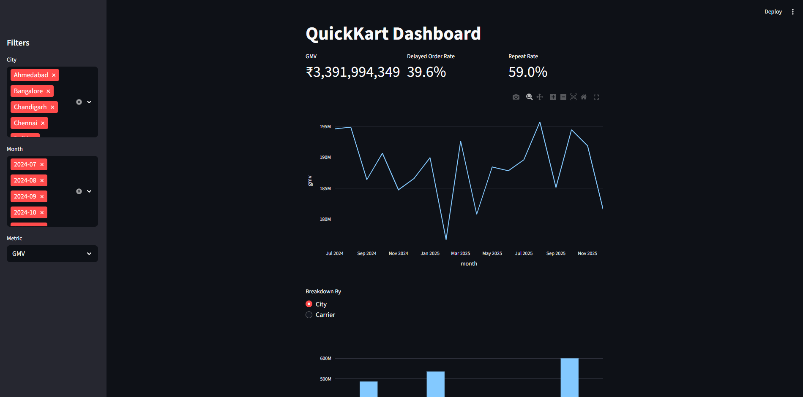

# quickkart-marketplace-analytics
Marketplace and logistics analytics project using Python, DuckDB SQL, and Streamlit. Analyzed GMV trends, customer retention, delivery performance, and carrier-level operational metrics through EDA, SQL, and an interactive dashboard.


# QuickKart Marketplace & Logistics Analytics

## Overview

This project analyzes an 18-month e-commerce marketplace dataset containing customers, sellers, products, orders, order items, and shipment records.

The objective was to understand how marketplace performance and logistics operations impact key business metrics such as:

- Gross Merchandise Value (GMV)
- Order Volume
- Repeat Purchase Rate
- Delivery Delays
- Carrier Performance
- Seller Performance

## Business Questions

The analysis focuses on:

1. How are GMV and orders trending over time by city and category?
2. How do delivery delays impact repeat purchase behavior?
3. Which seller–carrier–city combinations drive the most delays?
4. Which operational areas should be prioritized to improve customer experience and revenue?

## Dataset

The project uses six tables:

| Table | Description |
|---------|-------------|
| customers | Customer information and segmentation |
| sellers | Seller information and ratings |
| products | Product catalog and categories |
| orders | Order lifecycle information |
| order_items | Line-level order details |
| shipments | Logistics and delivery performance |

## Tools & Technologies

- Python
- Pandas
- DuckDB
- Plotly
- Streamlit
- SQL


## Data quality check:
Data quality checks identified 5,473 shipments without delivery timestamps, all corresponding to either InTransit (5,043) or Lost (430) statuses and therefore consistent with expected business logic. Shipment records accounted for 81,660 of 82,069 delivered orders and 4,861 of 4,882 returned orders. The small unmatched population (409 delivered orders and 21 returned orders) is not expected to materially impact aggregate analyses.

## Business problem:
Delivery delays are increasing → customer complaints are increasing → leadership worries about repeat purchases and GMV.

## Key Findings using EDA:

-- GMV Trend

Monthly GMV remains relatively stable between ₹177M and ₹196M throughout the 18-month period. 
There is no clear long-term upward or downward trend.
A few months stand out:
•	Feb 2025 has the lowest GMV (~₹177M). 
•	Aug 2025 has the highest GMV (~₹196M).
Most months fluctuate within this range

-- GMV is concentrated in major metropolitan cities, with Mumbai, Delhi, and Bangalore emerging as the top revenue-generating cities. This concentration suggests that operational improvements in these cities would have the greatest impact on overall marketplace performance.

-- Electronics is the dominant revenue driver for the marketplace, contributing the majority of total GMV by a significant margin. Home & kitchen and Fashion come second, while Books and grocery represent a relatively small share of platform revenue.

-- orders and active customers over time
changes in order volume are primarily driven by changes in customer activity rather than dramatic shifts in customer purchasing behavior.

-- both metric reach their lowest point on february 2025, this looks more like a demand slowdown rather than an operational issue affecting only orders.
-- both metrics peak again at october 2025 suggesting seasonal demand or may be succesful customer acquisition at that time.(Not sure !)

There has been consistent increase in monthly repeat rate over the period of analysis. This neccesarily may not mean retention is improving because repeat customers are defined cumulatively as customers with at least two delivered orders up to that point, the metric naturally increases over time as customers accumulate more purchases.

NOTE: A more better retention analysis could utilize customer cohorts.

-- Share of delayed orders by city & carrier
Jaipur and Lucknow are the biggest problem areas. More than half of all packages sent here are delayed (around 55%).
Close to half of the deliveries in kolkata is facing delays.
In terms of carriers, Delhivery and Ekart are the worst performers, delaying more than 35% of their shipments.
BlueDart does slightly better, but still delivers about 31% of its packages late.
inHouse delivery network is by far the most reliable. The delay rate is only 13%.

## Key Insights

### 1. Revenue Concentration

Mumbai, Delhi, and Bangalore contribute a significant share of platform GMV.

### 2. Category Concentration

Electronics generates the majority of marketplace GMV.

### 3. Stable Marketplace Activity

Monthly GMV, orders, and active customers remained relatively stable throughout the analysis period.

### 4. Delivery Performance

Delay rates vary significantly across carriers and destination cities, indicating operational bottlenecks.

## SQL Analysis

DuckDB SQL was used to answer business questions including:

- Monthly marketplace metrics
- Repeat purchase behavior
- First-order delay impact
- Seller–carrier performance
- Query optimization and indexing recommendations

## Streamlit Dashboard

The dashboard allows stakeholders to:

- Filter by date range
- Filter by city, category, and carrier
- Explore GMV, order volume, repeat rate, and delay rate
- View KPI summaries and monthly trends



## Run Locally

Install dependencies:

```bash
pip install -r requirements.txt

streamlit run streamlit_app/app.py
